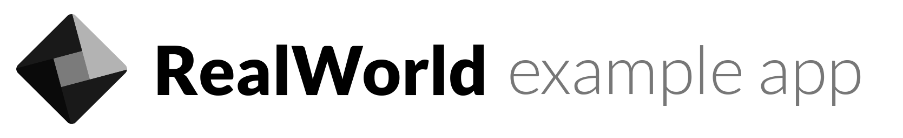
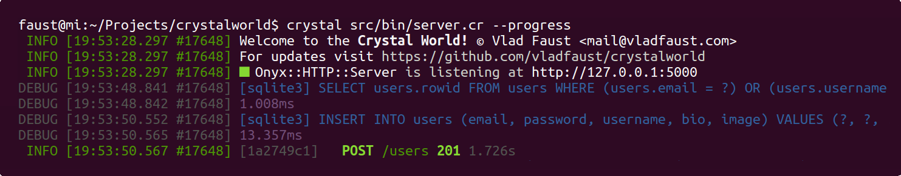

# 

[](https://crystal-lang.org/)
[](https://travis-ci.org/vladfaust/crystalworld)
[](https://github.com/veelenga/awesome-crystal)
[](https://vladfaust.com)

Welcome to the Crystal World, a [RealWorld back-end API](https://realworld.io) application implemented in [Crystal](https://crystal-lang.org)!

## About

This project aims to demonstrate of how simple and enjoyable it is to develop a high-performance web application in [Crystal](https://crystal-lang.org), which is proven to be both *fast* and *slick* language, featuring:

* ⚡️ **Efficiency** comparable to C
* 🍃 **Beauty** inherited from Ruby
* 🔒 **Type system** with smart compiler

Crystal World relies on [Onyx framework](https://github.com/onyxframework) as its foundation. The database chosen is SQLite. Go ahead and read the source code, you'll find it delightfully simple and understandeable! 🍰

*Note that although Crystal itself is not officially released yet, it's already being used in many real-world (including business) applications.*

## Installation

Clone this repository with

```shell
git clone https://github.com/vladfaust/crystalworld.git && cd crystalworld
```

Crystal is a compiled language. It has different compilation modes, e.g. development and production. Production code is faster and packed into a single binary, however its builds take more time. Therefore, there are multiple ways to proceed:

### Production build with Docker

1. Build an image:

```sh
> docker build -t crystalworld:latest .
```
2. Apply migrations:

```sh
> docker run -e DATABASE_URL="sqlite3://./crystalworld.db" crystalworld bin/cake db:migrate
```

3. Launch the server

```sh
> docker run -p 5000:5000 -e DATABASE_URL="sqlite3://./crystalworld.db" \
-e JWT_SECRET_KEY="63a051d73d71c997d38946f82e708301" crystalworld
```

### Production build from the source code

0. [Install Crystal](https://crystal-lang.org/docs/installation/) on your machine
1. Set env vars

```sh
> export DATABASE_URL="sqlite3://./crystalworld.db" CRYSTAL_ENV=production \
JWT_SECRET_KEY="63a051d73d71c997d38946f82e708301"
```

2. Build the app

```sh
> time shards build --production --release --no-debug --progress --stats
```

3. Apply migrations

```sh
> ./bin/cake db:migrate
```

4. Launch the server

```sh
> ./bin/server
```

### Development build from the source code

0. [Install Crystal](https://crystal-lang.org/docs/installation/) on your machine
1. Create an `/.env.development.local` file and put some environment variables there (see below)
2. Apply migrations

```sh
> crystal src/bin/cake.cr -- db:migrate
```

or install [Cake](https://github.com/axvm/cake) and exec `cake db:migrate`

3. Launch the server in development mode

```sh
> crystal src/bin/server.cr --progress
```

Example output:



## Environment variables

Crystal World follows [twelve-factor methodology](https://12factor.net/) and therefore relies on environment variables. You can see example and default variables at `/.env.example` file.

## Testing

Crystal has a convenient testing environment built-in. Read more at [Testing docs](https://crystal-lang.org/docs/guides/testing.html). Basically, you place specs under `/spec` folder and run them with `crystal spec`. It's also a good idea to have a separate `/.env.test` file.

Real World comes with integration testing suit, which can be found at <https://github.com/gothinkster/realworld/tree/master/api>. Crystal World uses this script in its CI, so if the badge is green it means that all the integration tests are passed. You can run these tests locally on your machine as well, just to be sure.

## Contributors

- [@vladfaust](https://github.com/vladfaust) Vlad Faust - creator, maintainer

## Licensing

This software is licensed under [MIT License](LICENSE).

[](https://opensource.org/licenses/MIT)
